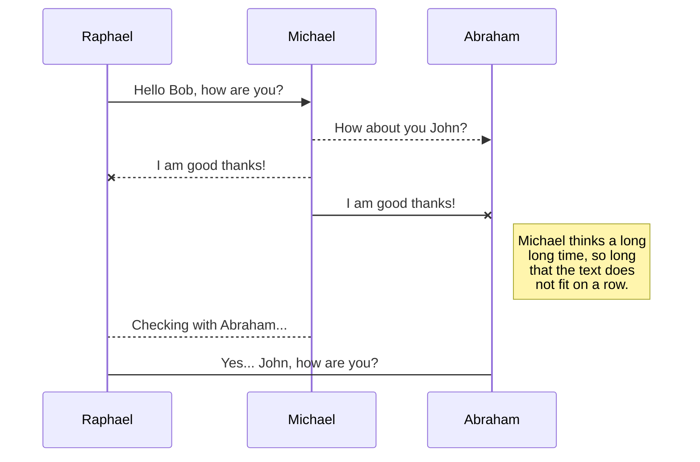

# Welcome to Course_001
Lorem ipsum dolor sit amet, consectetur adipiscing elit. Mauris in dolor diam. Nunc ac metus gravida, semper tellus eget, hendrerit sapien. Aliquam ac sodales erat, sed scelerisque libero. 

# Activities

Lorem ipsum dolor sit amet, consectetur adipiscing elit. Mauris in dolor diam. Nunc ac metus gravida, semper tellus eget, hendrerit sapien. Aliquam ac sodales erat, sed scelerisque libero. 
- Nam at facilisis sapien, non tristique leo. Vivamus tempor arcu in felis maximus aliquam. Quisque sit amet fermentum dolor. Vivamus gravida eleifend tincidunt.
- Nam at facilisis sapien, non tristique leo. Vivamus tempor arcu in felis maximus aliquam. Quisque sit amet fermentum dolor. Vivamus gravida eleifend tincidunt.

## Examples

You can render UML diagrams using [Mermaid](https://mermaidjs.github.io/). For example, this will produce a sequence diagram:

